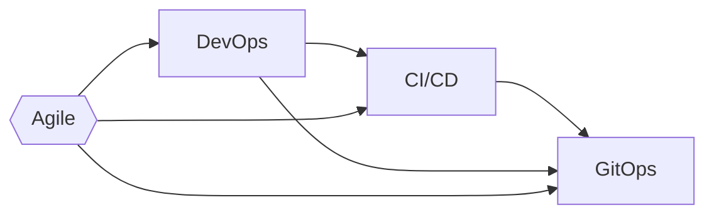

<span class="text-8xl text-white" style="font-weight:700;" >
    Git<span class="text-blend">Ops</span> <!-- <logos-git-icon /> --> <!--light-icon icon="git-pull-request"/-->
</span>
<div class="text-5xl text-primary-lighter mb-2rem" style="font-weight:500;" >
    Beyond Patterns and Principles
</div>
<div>
    Joel Bennett
</div>
<div>
    April 8-11, <span class="text-blend">2024</span>
</div>

---
layout: image-center
image: images/summit_sponsor_updated_4.png
title: Summit Sponsors
routeAlias: Summit Sponsors
level: 1
---

## Thanks as always to our sponsors!

---
layout: image-right-pop
image: https://HuddledMasses.org/assets/images/avatar.png
routeAlias: About Me
title: About Me
level: 2
---

# Joel "Jaykul" Bennett

## Principal DevOps Engineer

``` text
Solving problems with code
15x Microsoft MVP for PowerShell
```

  <div class="absolute bottom-16 left-16">
    <a href="https://github.com/Jaykul"><logos-github-icon /> github.com/Jaykul</a> and <a href="https://github.com/PoshCode">PoshCode</a><br/>
    <a href="https://discord.gg/PowerShell"><logos-discord-icon /> discord.gg/PowerShell</a><br/>
    <a href="https://HuddledMasses.org"><emojione-statue-of-liberty /> HuddledMasses.org</a><br/>
    <a href="https://fosstodon.org/@Jaykul"><logos-mastodon-icon /> @Jaykul@FOSStodon.org</a><br/>
  </div>

<!--

For those of you who came to this talk despite not knowing me, thank you, and let me introduce myself.

I'm Joel Bennett, and I'm from upstate New York by way of the grasslands of Guanacaste, Costa Rica. I have been "Jaykul" (J. Cool) online since the 1990s, and I'm currently a Principal DevOps Engineer! I've been solving problems with code since the last century, and I've been recognized as a Microsoft MVP for PowerShell fifteen times in a row now. I am an open source developer, and I coordinate the official PowerShell support chat and virtual user group, so you can find me on GitHub, Discord, Mastodon, and more rarely on Slack and Twitter, and I'm always happy to chat about PowerShell, DevOps, GitOps.

-->

---
layout: section
background: images/B140E5B2DC52AD0D725F57CA8E7DF9F964A76BC154077A342923084D82A3A92C.jpg
routeAlias: What is GitOps
title: What is GitOps?
level: 2
---

# What is GitOps?

<v-clicks>

## Principles for Operating and Managing Software Systems

### We are not merely building infrastructure from code

### We seek to create _systems_ that continuously update and repair themselves

</v-clicks>

<!--
So, what is GitOps? Can anyone put it in a single sentence?

The [OpenGitOps][1] project -- which is a Cloud Native Computing Foundation ([CNCF][3]) Sandbox project from the [GitOps Working Group][2] under the CNCF _App Delivery_ Technical Advisory Group (TAG), defines GitOps as

**{NEXT}** "a set of principles for operating and managing software systems."

**{NEXT}** GitOps definitely includes infrastructure as code, but it's not that simple.

**{NEXT}** GitOps is about creating systems that continuously update and repair _themselves_.

## I hope you heard me when I said that:

### GitOps principles are about _operating_ and _managing_ software systems, not _building_ them.

You can follow GitOps Principles even when you're hosting _third party_ software, and not writing your own applications, but it's not relevant if you are building software for others to run. In other words, GitOps Principles apply only to a _strict subset_ of DevOps, and GitOps is not a _replacement_ for DevOps.

I have to admit that _for software as a service_, I do think of GitOps as an important extension of _Agile_, _DevOps_, and _Continuous Delivery_ -- but it does not **replace** any of them. In fact, these terms are so **overused** in recruiting and marketing that sometimes GitOps practitioners actually object to being associated with them, so I'm going to take _just 2 minutes_ to quickly **{NEXT}** go through the historical context before we talk about the definition of GitOps.

[1]: https://opengitops.dev/
[2]: https://github.com/cncf/tag-app-delivery/tree/main/gitops-wg
[3]: https://www.cncf.io/

-->

---
rightHeader: What is GitOps?
routeAlias: Historical Graph
title: Historical Graph
level: 3
---

# Historical Context

<!--

-->

```mermaid {fontFamily: 'Ubuntu', gitGraph: { mainBranchName: 'Agile', showCommitLabel: false } }
gitGraph
    commit tag: "1993"
    commit
    branch DevOps
    checkout DevOps
    checkout Agile
    commit tag: "2001: Agile Manifesto"
    branch Continuous
    checkout DevOps
    commit tag: "2008"
    checkout DevOps
    checkout Continuous
    merge DevOps tag: "2010"
    checkout Agile
    commit
    checkout DevOps
    commit
    checkout Continuous
    branch GitOps
    checkout Continuous
    commit
    checkout GitOps
    commit tag: "2017"
```

<!--
I want to take _just 2 minutes_ to quickly go through the historical context before we talk further about the definition of GitOps.
-->

---
rightHeader: What is GitOps?
routeAlias: Historical Context
title: Historical Context
level: 3
---

# Historical Context

## Agile Software Development (2001)

The [_agile manifesto_](http://agilemanifesto.org/) prioritized collaboration and flexibility...

<v-clicks every="2" >

## DevOps (2008)

DevOps centers on cultural change, unifying Dev and Ops organizations with common goals and shared KPI.

## Continuous Delivery (or Deployment) (2010)

Continuous Delivery became a noun, with a focus on automated pipelines, and small, frequent releases.

## GitOps (2017)

GitOps is a _set of principles_ for operating and managing software systems.

</v-clicks>

<!--

Back in 2001 engineers who were doing what they called "agile software development" got together and signed the [_Agile Manifesto_][0]. There are twelve principles behind it, but the first and "highest priority is to **satisfy the customer through early and _continuous delivery_ of valuable software.**"" The core ideas of Agile are about _people_ and their attitudes, and how to manage people in projects: let them self-organize, welcome change, reflect on the results, _adapt_ your processes. The agile manifesto focuses on people, and how they _collaborate_, and _communicate_.

**{NEXT}** However, as developers sought _agility_ through _continuous delivery_, they began to feel that traditional operations teams and frameworks (like [ITIL][1]) **were** the bottleneck. Thus was born the [DevOps movement][2], which is all about the _cultural change_ necessary to _unify_ software development (Dev) and operation (Ops) organizations. Adopting DevOps means finding common goals and principles between those two groups, and establishing shared performance indicators and shared responsibility, so they do not work at cross-purposes.

**{NEXT}** Meanwhile, teams that did not hit bottlenecks started talking _more_ about "Continuous Delivery." They created integrated teams, with developers, testers, and operations engineers together, and focused on increasing the reliability and frequency with which they could build, test, and release software. They found a great deal of success by focusing on the _technical processes_ required and  **automating** build, test, and deployment. Ultimately they showed a great deal of success at reducing both _cost_ and _risk_ by enabling small, incremental changes, released frequently. In 2014, Dr. Dobbs magazine actually called Continuous Delivery "The Agile Successor."

I want to be remind you: **Continuous Delivery** was just _the first principle_ of Agile. In my opinion, it would be ridiculous to decide, a decade later, that Continuous Delivery replaces Agile -- it's almost as if the Scotsman John Boyd *Dunlop*, upon creating a pneumatic tyre in 1888 had said: Hey, I've finally built the perfect wheel, it's the successor to the _motor car_!

Anyway, that's the backdrop.

**{NEXT}** GitOps principles are derived from modern software operations and they are rooted in these pre-existing and widely adopted best practices. The new term "GitOps" was coined by Weaveworks CEO Alexis Richardson in a blog post in 2017, and through the CNCF (Cloud Native Computing Foundation), it quickly became a term of art which they have worked to define and promote. So maybe what you really wanted to know is: what are these GitOps principles?

[0]: http://agilemanifesto.org/
[1]: https://www.ibm.com/topics/it-infrastructure-library
[2]: https://www.atlassian.com/devops/what-is-devops/history-of-devops
-->

---
rightHeader: What is GitOps?
layout: two-cols
layoutClass: open-gitops
leftClass: col-span-4
rightClass: col-span-8
routeAlias: GitOps Principles
title: GitOps Principles
level: 3
---

::left::

# GitOps

## Principles

### v1.0.0 {.pl-3}

::right::

### Declarative {.before:content-['1']}

<v-click at="1" >

A _system_ managed by GitOps must have its desired state expressed _declaratively_.

</v-click>

### Versioned and Immutable {.before:content-['2']}

<v-click at="1" >

Desired state is _stored_ in a way that enforces immutability, versioning and retains a complete version history.

</v-click>

### Pulled Automatically {.before:content-['3']}

<v-click at="1" >

Software agents automatically pull the desired state declarations from the source.

</v-click>

### Continuously Reconciled {.before:content-['4']}

<v-click at="1" >

Software agents _continuously_ observe actual system state and _attempt to apply_ the desired state.

</v-click>

<!--
So (according to the GitOps Working Group) ...

The desired state of a GitOps managed system must be: ...

Actually, take a minute to read this yourselves.

**{NEXT}**

Apart from a glossary, this is the entirety of what the Cloud Native Computing Foundation working group has been able to agree on about GitOps.

**{PAUSE}**

As you can see, GitOps does not focus on collaboration, nor on people or organization. It's simply _practical principles_ for managing software systems: how should we express and store the desired state, and how do we ensure that the system _remains_ in that state.

### Let's dig into it a little more.
-->

---
layout: image-right
rightHeader: What is GitOps?
image: images/turtles-all-the-way-down.jpg
bleed: true
routeAlias: Declarative, Versioned and Immutable
title: Declarative, Versioned and Immutable
level: 4
---

# Declarative

The code for the desired state is _independent_ of the steps needed to get there.

<v-click>

# Versioned and immutable

## It's code all the way down

1. The software _source_ is code
2. The infrastructure _source_ is code
3. The configuration _source_ is code
4. _All **source** code is version controlled_

</v-click>

<!--
What does it mean that our desired state is _declarative_?:

In programming, we talk about Imperative code, which describes a set of steps to be taken to achieve a goal, and about Declarative code, which simply describes the goal itself.

The Desired State of systems always needs to be written _declaratively_,
expressing _how things should be_, without regard for _how they currently are_,
because there are too many possible actual states.
We succinctly describe our desired state, and rely on an agents or operator to analyze the current state and determine the specific steps to be taken...

**{NEXT}**

I tend to think that versioning your state declaration is so obvious at this point that it goes without saying, but some people need every detail spelled out, and others will _deliberately_ flaunt anything that's not in writing. For the record:

1. Developers have been tracking changes to their source code for decades
2. Of course, you know you should declare your infrastructure as (source) code
3. Please believe that you need to treat your configuration as source code too
4. And obviously, you need to store _all code_ in your version control system

It does _not_ have to be git. In fact, you should probably just use whatever your developers already use.

The requirement here is that you have versions of your desired state that are immutable, and you can revert, and thus (re)deploy an old version.

-->

---
layout: image-right
rightHeader: What is GitOps?
image: images/robotic-agents.jpg
bleed: true
routeAlias: Software Agents
title: Software Agents
level: 4
---

# Pulled Automatically

GitOps uses **software agents** that **pull** the desired state from source. This scales well, and only requires _read_ access to source.

<v-click>

# Continuously Reconciled

**Reconciliation** is the process of ensuring the _actual state_ matches the _desired state_. It's triggered _whenever_ there is a divergence -- whether a new version of the desired state, or drift in the actual state.

</v-click>
<v-click>

## Continuous Deployment is great

### But please don't conflate

</v-click>

<!--

The key thing that **distinguishes** GitOps are _software agents_ that automatically pull the desired state from source and _continuously_ attempt to apply it through a process known as **{{NEXT}}** reconciliation.

Reconciliation is _**not** just_ triggered by commits to source control. GitOps includes continuous monitoring and repairing. It's not just about _deploying_ when there's a new versions, it's about _monitoring_ the system, and keeping it in the desired state.

GitOps is deliberately defined so it can expand to control all of the _desired state_ of systems -- not just the infrastructure are code, or which version of the software, or the configuration, but also what the _performance_ and _availability_ of the system _should be_.

**{{NEXT}}**

#### Now. You _will_ see people talking about "push GitOps" ...

_Here's my two cents:_ People who downplay the "pull" are usually also downplaying the "agents" and most often they are trying to coopt the term "GitOps" to describe _whatever product they were already selling_ for continuous deployment. That's not useful.

We love Continuous deployment.

**{{NEXT}}**

But let's not confuse things. Using pipelines to trigger Continuous Deployment on merge to main is not GitOps. It's Continuous Deployment.


-->

---
layout: default
rightHeader: What is GitOps?
routeAlias: GitOps Wants to be More
title: GitOps Wants to be More
level: 3
---

# GitOps wants to be more

<v-clicks>

## Conceptually different

> GitOps follows [control theory](https://en.wikipedia.org/wiki/Control_theory) and operates in a closed-loop, where feedback represents how previous attempts to apply a desired state have affected the actual state. Actions are taken based on policies, it order to _reduce deviation_ over time.

- ### Is the Octopus Deploy Agent a GitOps agent?
- ### Is Windows Desired State Configuration (DSC) a GitOps agent?

</v-clicks>

<!--
GitOps is more than Continuous Deployment. But also, GitOps _wants_ to be more than it currently is...

**{{NEXT}}**

There is a _conceptual_ difference, because as I said before,
the core of GitOps are these automated agents,
and they monitor the current state,
in addition to polling for new versions.

But it's more than that. Although they failed to capture this in the four principles, Open GitOps explains in their glossary that ...
**{{NEXT}}**

GitOps is based on control-theory, a field of engineering and applied mathematics that develops systems like cruise control and thermostats.
This means that Agents should work to drive the system to it's desired state while minimizing delay, overshoot, and steady-state errors, ensuring stability and optimality.

In other words, although a _minimum_ implementation today might just:
- automatically destroy deviating cattle servers (or containers) and
- deploy new infrastructure (or containers) based on the template, and then
- deploy the correct version of the software, and finally
- set the configuration to the current values ...

The goal is for agents to make smaller changes to move the system _toward_ the desired state.
They should be _feedback_ driven, and _policy_ driven, and they should _reduce deviation_ over time.

**{{NEXT}}**
Here are a couple of questions for you:
- Is the Octopus Deploy Agent (or the Azure Pipelines agent) a GitOps agent?
- Is Windows Desired State Configuration (DSC) a GitOps agent?

The Octopus Deploy Agent and the Azure Pipelines Agent are _push_ agents, and they just waits for jobs to be pushed to them. They do not monitor anything. They also work with _imperative_ instructions, not _declarative_ desired state.

On the other hand, DSC (or the LCM, specifically), has versioned and declarative desired state, which it pulls automatically, and continuously reconciles. It's not a perfect match, because it doesn't actually have multiple versions in the source... but it's very close. At work we've built a system where we manage our desired state as json files, and "build" MOF files (and publish to the Pull server) on commit to main. Each of our servers has the LCM configured in pull mode to continuously monitor and pull new versions....

The **desired state** can include specific measurable results (like performance indicators, response time, etc.) and Agents should work to drive the system to it's desired state while minimizing delay and overshoot to achieve stability and optimality. In an ideal system, agents would automatically find the balancing point between conflicting goals, but we're not there yet.

One point to mention here: at this stage, it doesn't really matter _how_ this is achieved. WHether it's event-based monitoring of actual state changes, or polling the state over and over again. Whether the agent runs in the hosting environment, or connects to it remotely. Whether it pulls the desired state directly from git, or there's a pipeline that moves code from source control to a "current version" artifact.

There are already many tools available in this space, and we've clearly not reached peak GitOps -- picking agents right now comes down to making the right trade-offs for your systems, and you will probably need to combine and layer several tools to get where you want to be.

-->

---
layout: section
contentClass: grid grid-cols-2 gap-1em
background: images/1D4DE7B5F033B943E76816266DFA5516449B9CF69FF900CE7D37801E3134D64A.jpg
routeAlias: Tooling
title: Tooling
level: 2
---

# Tooling

- ## <Link to="Infrastructure As Code">Infrastructure As Code</Link>
- ## <Link to="Continuous Delivery">Continuous Delivery</Link>
- ## <Link to="GitOps Agents">GitOps Agents</Link>

---
rightHeader: Tooling
routeAlias: Infrastructure As Code
title: Infrastructure As Code
level: 3
---

# Infrastructure As Code
## The Code Should be _Declarative_
## The Tools Should be _Idempotent_

- [Terraform](https://www.terraform.io/) by Hashicorp, and [OpenTofu](https://opentofu.org/) by Linux Foundation
- [Pulumi](https://www.pulumi.com/) supports Yaml -- but also C#, Python, Go, TypeScript.
- [Idem](https://www.idemproject.io/) by VMWare (infrastructure as "data" = yaml)
- [Radius](https://radapp.io/) does Bicep **and** Terraform
- [Bicep](https://github.com/Azure/bicep/) / Arm / [CloudFormation](https://aws.amazon.com/cloudformation/)

<!--

There are many options here, and I'm not going to recommend one over another.

Presumably you've heard of most of these, the newcomers are Radius and Idem.

VMWare claims Idem is the first "infrastructure as data" tool. Of course, their "data" comes in the form of yaml files, so really they're very close to the same as all the others here. I guess I don't care what they call it. Idem is interesting partly because it has a `describe` mode, which generates the yaml for you, but it's quite rough around the edges right now for getting started.

Microsoft's Radius is interesting because it provides extra abstraction layers. Developers write code in _either_ Bicep or Terraform, and ask for a high-level "document database" object. When they "deploy" that locally, it spins up MongoDb in a container, but deployed to AWS it's a Amazon DocumentDB, and in Azure it's CosmosDB. The idea is that developers pick from "recipes" that the operations team creates.

-->

---
rightHeader: Tooling
routeAlias: Continuous Delivery
title: Continuous Delivery
level: 3
---

# Continuous Delivery
## Build, Test, Package

Every source-hosting platform has a CI/CD system...

<div class="columns grid grid-auto-flow-col gap-1em grid-rows-1">

<div>

- GitLab
- GitHub Actions
- Azure Pipelines

</div><div>

And there are many, many others.

- Bamboo (BitBucket)
- CircleCI
- TeamCity
- Travis CI
- Jenkins

</div><div>

<v-click>

## &nbsp;

Some even run in Kubernetes:

- [GitLab **Agent**](https://docs.gitlab.com/ee/user/clusters/agent/ci_cd_workflow.html)
- [Tekton](https://tekton.dev/)
- [Jenkins X](https://jenkins-x.io/)
- [Skaffold](https://skaffold.dev/)

</v-click>

</div>
</div>

<!--

If you thought there were a lot of tools for Infrastructure as Code, you're going to be overwhelmed by the number of tools available for Continuous Delivery. Remember that in GitOps, Continuous Delivery is usually just the build, unit testing, and creation of a versioned package. The release (and deployment) is handled by the GitOps tooling.

Obviously, the easy choice is the one that comes with your source control system. Normally we'd only look at the others if we had a specific need. And as with the IaC tools, I want to mention a few that are newer:

**{{NEXT}}**

First, you've probably all heard of GitLab, but they have gone all-in with support for GitOps on Kubernetes, and have integrated Flux, as well as a GitLab Agent for CI/CD that runs directly on Kubernetes. They have rolled their own, so this is a particularly interesting approach if you're already familiar with their build system. Now, you can run a build and CI/CD pipeline from inside your clusters, produce and publish a container, generate a release and push to your GitOps repo, hen use Flux to deploy and reconcile, all within their supported ecosystem.

Second, Jenkins-X, a re-imagining of Jenkins built on top of Tekton, which is really just a framework for creating custom CI/CD systems which run on Kubernetes. This means you can build, test, and deploy across cloud providers and on-premise, promote changes from one environment to another via GitOps and pull requests, etc. Jenkins X does the extra work to integrate with your git provider and comments on your PRs, and update you on the status of the pipelines.

-->

---
layout: image-center
image: images/CNCFLandscape.png
rightHeader: Tooling
routeAlias: GitOps Agents
title: GitOps Agents
level: 3
---

# GitOps Agents

- Flux
- ArgoCD
- Fleet

<!--

Obviously, GitOps is the new kid on the block here, and I'm really only aware of three tools that actually do GitOps (and I have not tested **Fleet**, by Rancher (SUSE), yet). There are a few _commercial_ tools building on top of these.

Obviously we already mentioned GitLab is building their GitOps tooling on top of Flux now, as are Azure (AKS /Azure GitOps) and AWS (EKS Anywhere). Harness is building on top of ArgoCD. There are others that are offering consulting services (like the now-defunct Weaveworks and ControlPlane).

**{{NEXT}}**

The CNCF Landscape you saw yesterday in the keynote has a section for "Continuous Integration and Delivery" but of all these listed, only the ones I've already mentioned are working on GitOps tools.

Well, let's take a look at some tools in action.

-->


---
layout: section
contentClass: grid grid-cols-2 gap-1em
background: images/1156B356C54605DE91835100F2FA7C865F8441711E24B60E9B722ED72EE572FF.jpg
routeAlias: Show and Tell
title: Show and Tell
level: 2
---

# Show and Tell

- ## [AKS-Bicep](https://github.com/poshcode/aks-bicep)
- ## [Cluster](https://github.com/poshcode/cluster)

---
layout: section
contentClass: grid grid-cols-2 gap-1em
background: images/B08599196B1133A13BF7F4A41EAE96841A9A6EBF79CB7121ACB8A3961469DFF2.jpg
routeAlias: Best Practices
title: Best Practices
level: 2
---

<div class="col-span-2">

# Best Practices

Or, how do I GitOps?

</div>

## <Link to="Standardization">Standardization</Link>

## <Link to="12 Factor App">Twelve-Factor Apps</Link>

## <Link to="Change Management">Change Management</Link>

<!--

We **definitely** don't have time for a full deep dive into best practices, but I want to touch on a few things that I think are most useful to people who are just getting starting with GitOps Principles, so let's spend a few minutes talking about these.

Remember, GitOps basically assumes you're already doing DevOps. That you have a culture of collaboration and shared goals and responsibility, with a focus on automation and repeatability.
-->

---
rightHeader: Best Practices
routeAlias: Standardization
title: Standardization
level: 3
---

# Standardization

In short, you can't control a train or a ship with the autopilot for a Tesla.

<v-click>

## Especially with micro-services

### Automation requires standardization

### Reduce variations and alternatives

### Avoid custom one-off implementations

</v-click>

<!--

Let's talk about this as control theory. Let's say you're building a thermostat or a cruise control. Imagine I built an auto pilot for a sports car, and then tried to use it to control my fleet of tractor trailers. Or Imagine we built a thermostat for forced-air industrial HVAC systems in gyms. Are we going to be able to use that to control the heat in an multi-floor apartment building that uses steam radiators?  No. You'll overheat the apartments every time, and flip back and forth between too hot and too cold, and broil the upstairs and freeze the downstairs.

The biggest _improvements_ from following GitOps Principles come when you're managing systems that are made up of many small services, where those services are all built with the same technologies and frameworks, are packaged and deployed the same way, have similar configuration, monitoring, and management options, and even have similar density and scale requirements.

None of this is to say you can't have different classes of systems, just that each time you have something that's different it will cause friction and extra work.

For each type of system, all the teams that interact with it need to build custom knowledge and understanding, and in the worst case, unique, one-off agents or agent configurations.

-->

---
rightHeader: Best Practices
routeAlias: Best of Breed Tools
title: Best of Breed Tools
level: 3
---

# Standardization

<div class="columns grid grid-auto-flow-col gap-1em grid-rows-1">

<div>

### Start small

<v-click>

- Source control
- Pull requests
- Continuous **Delivery**
- Automate Deployments
- Health checks

</v-click>
</div><div>

### Best of breed tools

<v-click>

- Code-based
- Declarative
- Idempotent

</v-click>
</div><div>

### Dependency management

<v-click>

- Vulnerability scanning
- Prevent stale
- Included in Health Checks
- Included in Auto Scaling

</v-click>
</div>
</div>

<!--

To minimize the cost of managing systems with software agents, we need to standardize _everything_ that we can. Beyond how we build and deploy the software, to how we manage dependencies, how services are configured, how they scale (and how we know they need to scale). We increase our ability to change quickly by standardizing as much as possible.

**{NEXT}**

Don't assume that what works for others will work for you.
- Start small, with a single project, and make sure you have the basics in place:
- If you don't have source control, start with that.
- If you don't use pull requests, start with that.
- If you don't have automatic builds that deliver versioned packages, start with that.
- If you don't have automated deployments, start with that.
- If you don't have health checks, add those.

**{NEXT}**

As you identify your next steps, evaluate and choose tools.
Try to always **PICK THE _BEST_ TOOLS** so you won't be tempted to switch, and won't need to let people use alternatives. Use the same tools across all of your projects. This is not to say you'll never re-evaluate and choose new tools, but avoid having multiple options you need to build separate control systems for.

When you're picking tools, keep those two words in mind: declarative and idempotent. Remember:
- Infrastructure and Configuration code should be declarative, separating the desired state from the steps needed get there.
- The automation that builds infrastructure, or applies configuration should be idempotent, so that it can be run repeatedly without causing harm.
  If you can't find idempotent tools, this might be worth the custom development to wrap your tools in check scripts to make them idempotent.

**{NEXT}**

Finally, make sure you have a good dependency management system.
This isn't just about libraries, it's also about service-to-service dependencies.
Make sure you know where your dependencies are, that you have health checks and scaling in place.

How do you track dependencies. I don't mean just binaries you need at build time, but which services depend on others. Your health checks should make this obvious, since they should test the upstream services. Do they scale together? Do your service's dependencies scale (up, and down) fast enough when the front line service scale?
 -->

---
layoutClass: columns grid-rows-5
rightHeader: Best Practices
routeAlias: 12 Factor App
title: The Twelve-Factor App
level: 3
---
<div class="col-span-3">

# The Twelve-Factor App ([12factor.net](https://12factor.net/))

</div>

<!-- <v-clicks> -->

<div>

### <Link to="codebase">I. Codebase</Link>

One codebase tracked in revision control, many deploys

</div><div>

### II. <Link to="dependencies">Dependencies</Link>

Explicitly declare and isolate dependencies

</div><div>

### III. <Link to="config">Config</Link>

Store config in the environment

</div><div>

### IV. <Link to="resources">Backing services</Link>

Treat backing services as attached resources

</div><div>

### V. <Link to="build">Build, release, run</Link>

Strictly separate build and run stages

</div><div>

### VI. <Link to="processes">Processes</Link>

Execute the app as one or more stateless processes

</div><div>

### VII. <Link to="port-binding">Port binding</Link>

Export services via port binding

</div><div>

### VIII. <Link to="concurrency">Concurrency</Link>

Scale out via the process model

</div><div>

### IX. <Link to="disposability">Disposability</Link>

Maximize robustness with fast startup and graceful shutdown

</div><div>

### X. <Link to="parity">Dev/prod parity</Link>

Keep development, staging, and production as similar as possible

</div><div>

### XI. <Link to="logs">Logs</Link>

Treat logs as event streams

</div><div>

### XII. <Link to="admin">Admin processes</Link>

Run admin/management tasks as one-off processes

</div>

<!--

My personal favorite example of standardization is the Twelve-Factor app!

These factors are a methodology for writing software that works well in software as a service environments. 12 Factor Apps are designed to be _declarative_, _portable_, _scalable_, and _concurrent_. Following these factors tends to make it so that the operation of the apps doesn't even depend on the language or framework used to build them.

I actually consider two of these "factors" to be required for GitOps, regardless of your hosting environment.

But if you're doing GitOps with microservices, and especially on Kubernetes, I consider almost all of them to be mandatory.

I think this is also a great example of why GitOps isn't something the Ops or "DevOps" teams can pull off on their own. Obviously, you need developers, software architects, and engineering teams to all agree on these sorts of standards.

-->

---
layout: two-cols
rightHeader: Best Practices
routeAlias: Change Management
title: Change Management
level: 3
---

::header::

# Change Management

::left::

<v-click>

## Separate Repositories

Infrastructure != Application != Configuration

- Independent life-cycles
- Separate approval processes
- Different team ownership

</v-click>

::right::

<v-click>

## Environment Configuration

Don't use mono-repos or branch-per-environment

- Create versioned configuration artifacts
- Import artifacts, or inherit a shared base
- Use overlays for different environments
- Think about versioning and promotion of the base

</v-click>

<!--
I'm not a big fan of mono-repos in general, but for GitOps we have a few special reasons for separating our infrastructure, apps, and configuration repositories.

**{NEXT}**

- The primary reason is to keep the versioning separate, and avoid triggering CI/CD pipelines for config or infrastructure changes. You don't want a simple configuration change (like scaling a deployment from three to four replicas) to trigger a CI/CD rebuild and test of your application (especially not if that's required prior to being able to merge the change).
- You also don't want to hold up CI/CD builds with the change management approvals you might need for infrastructure changes, and one of the nice things about using git for infrastructure and configuration is that we can use git's built-in features for approvals and change tracking.
- You may have different teams responsible for infrastructure and application code or configuration, and different code-review or approval processes for code versus infrastructure or configuration.

You could, hypothetically, put a bunch of path filters on your triggers and validation rules, etc., but that adds unnecessary complications and potential for error.

**{NEXT}**

**HOWEVER**.Given what I just said, this may seem to go against the grain, but although you might be tempted to try to have separate branches per environment, or even separate repositories per environment, most of us with experience _doing_ this are advising against that, because

- Promoting from one environment to another is usually not as simple as a merge
- There is much that cannot be promoted from one environment to another: configuration, secrets, scale, etc.

Regardless of what tools you're actually using and what your hosting environment is, consider the layout used for Kustomize and Helm, where you have a "base" directory and then an overlay directory for each environment...


Make sure you consider how to protect your _production_ environment from changes that you are testing in _staging_ or _development_ environments.

-->

---
layout: section
background: images/1D4DE7B5F033B943E76816266DFA5516449B9CF69FF900CE7D37801E3134D64A.jpg
routeAlias: Background
title: Background
level: 2
---

# Background

---
rightHeader: Background
routeAlias: Agile Manifesto
title: Agile Manifesto
level: 3
---

# Agile Manifesto [(.org)](http://agilemanifesto.org/)

We are uncovering better ways of developing
software by doing it and helping others do it.
Through this work we have come to value:

#### **Individuals and interactions** over processes and tools

#### **Working software** over comprehensive documentation

#### **Customer collaboration** over contract negotiation

#### **Responding to change** over following a plan

That is, while there is value in the items on
the right, we value the items on the left more

---
layoutClass: columns grid-rows-4
rightHeader: Background
routeAlias: Agile Principles Part 1
title: Principles behind the Agile Manifesto (1/2)
level: 4
---
<div class="col-span-3">

# [Principles][1] behind the [Agile Manifesto][2] (1/2)

</div>

<!-- <v-clicks> -->

Our highest priority is to satisfy the customer through early and continuous delivery of valuable software.

Welcome changing requirements, even late in
development. Agile processes harness change for
the customer's competitive advantage.

Deliver working software frequently, from a
couple of weeks to a couple of months, with a
preference to the shorter timescale.

Business people and developers must work
together daily throughout the project.

Build projects around motivated individuals.
Give them the environment and support they need,
and trust them to get the job done.

The most efficient and effective method of
conveying information to and within a development
team is face-to-face conversation.

[1]: http://agilemanifesto.org/principles.html
[2]: http://agilemanifesto.org/

---
layoutClass: columns grid-rows-4
rightHeader: Background
routeAlias: Agile Principles Part 2
title: Principles behind the Agile Manifesto (2/2)
level: 4
---

<div class="col-span-3">

# Principles behind the Agile Manifesto (2/2)

</div>

Working software is the primary measure of progress.

Agile processes promote sustainable development.
The sponsors, developers, and users should be able
to maintain a constant pace indefinitely.

Continuous attention to technical excellence
and good design enhances agility.

Simplicity--the art of maximizing the amount
of work not done--is essential.

The best architectures, requirements, and designs
emerge from self-organizing teams.

At regular intervals, the team reflects on how
to become more effective, then tunes and adjusts
its behavior accordingly.

---
layoutClass: columns grid-rows-5
rightHeader: Best Practices
routeAlias: 12 Factor App (Redux)
title: The Twelve-Factor App (Redux)
level: 3
---
<div class="col-span-3">

# The Twelve-Factor App ([12factor.net](https://12factor.net/))

</div>

<!-- <v-clicks> -->

<div>

### <Link to="codebase">I. Codebase</Link>

One codebase tracked in revision control, many deploys

</div><div>

### II. <Link to="dependencies">Dependencies</Link>

Explicitly declare and isolate dependencies

</div><div>

### III. <Link to="config">Config</Link>

Store config in the environment

</div><div>

### IV. <Link to="resources">Backing services</Link>

Treat backing services as attached resources

</div><div>

### V. <Link to="build">Build, release, run</Link>

Strictly separate build and run stages

</div><div>

### VI. <Link to="processes">Processes</Link>

Execute the app as one or more stateless processes

</div><div>

### VII. <Link to="port-binding">Port binding</Link>

Export services via port binding

</div><div>

### VIII. <Link to="concurrency">Concurrency</Link>

Scale out via the process model

</div><div>

### IX. <Link to="disposability">Disposability</Link>

Maximize robustness with fast startup and graceful shutdown

</div><div>

### X. <Link to="parity">Dev/prod parity</Link>

Keep development, staging, and production as similar as possible

</div><div>

### XI. <Link to="logs">Logs</Link>

Treat logs as event streams

</div><div>

### XII. <Link to="admin">Admin processes</Link>

Run admin/management tasks as one-off processes

</div>

<!--

My personal favorite example of standardization is the Twelve-Factor app!

These factors are a methodology for writing software that works well in software as a service environments. 12 Factor Apps are designed to be _declarative_, _portable_, _scalable_, and _concurrent_. Following these factors tends to make it so that the operation of the apps doesn't even depend on the language or framework used to build them.

I actually consider two of these "factors" to be required for GitOps, regardless of your hosting environment.

But if you're doing GitOps with microservices, and especially on Kubernetes, I consider almost all of them to be mandatory.

I think this is also a great example of why GitOps isn't something the Ops or "DevOps" teams can pull off on their own. Obviously, you need developers, software architects, and engineering teams to all agree on these sorts of standards.

-->


---
rightHeader: 12 Factor App
routeAlias: codebase
title: Codebase
level: 4
---

# 1. Codebase

### There is always a one-to-one correlation between the codebase and the app {.resize}

- If there are multiple code bases, it's not an app -- it's a distributed system.
- Each component in a distributed system is an app, and each can individually comply with twelve-factor.
- Multiple apps sharing the same code is a violation of twelve-factor.
- Factor shared code into libraries which can be included through the <Link to="dependencies">dependency manager</Link>.

A deploy is a running instance of the app.

There is only one codebase per app, but there will be many deploys of the app: production, staging, etc.

The codebase is the same across all deploys, although different _versions_ may be active in each deploy.

---
rightHeader: 12 Factor App
routeAlias: dependencies
title: Dependencies
level: 4
---

# 2. Dependencies

### Explicitly declare and isolate dependencies

A twelve-factor app never relies on implicit existence of system-wide packages or system tools.

It **declares all dependencies**, completely and exactly, via a dependency declaration manifest, and uses **dependency isolation** to ensure no implicit dependencies "leak in" from the surrounding system.

One benefit of explicit dependency declaration is that it simplifies setup for developers new to the app.

---
rightHeader: 12 Factor App
routeAlias: config
title: Config
level: 4
---

# 3. Config

### Store config in the environment

An app's config is everything that is likely to vary between deploys (staging, production, developer environments, etc). This includes:

- Resource handles to the database, cache, and other backing services
- Credentials to external services such as Amazon S3 or Twitter
- Per-deploy values such as the canonical hostname for the deploy

One litmus test for whether an app has all config correctly factored out of the code is whether the codebase could be made open source at any moment, without compromising any credentials.

The twelve-factor app stores config in environment variables. These are easy to change, and hard to accidentally commit. They are a language- and OS-agnostic standard.

These variables are not grouped into sets or environments, but instead are granular and managed independently for each deployment.

---
rightHeader: 12 Factor App
routeAlias: services
title: Backing Services
level: 4
---

# 4. Backing Services

### Treat backing services as attached resources

A backing service is any service the app consumes over the network as part of its normal operation.

Examples include:

- Datastores (such as SQL, or MongoDB)
- Messaging/queueing systems (such as RabbitMQ or Service Bus)
- SMTP services for email (such as Postfix)
- Caching systems (such as Memcached or Redis)

Some are locally managed, others are third-party services. The code for a twelve-factor app makes no distinction between local and third-party services. To the app, both are _attached resources_, accessed via a URL or other locator and credentials stored in the config. Different instances of these resources can be swapped out without any changes to the app's code.

---
rightHeader: 12 Factor App
routeAlias: build
title: Build, Release, Run
level: 4
---

# 5. Build, Release, Run

### Strictly separate build and run stages

- The **build stage** is a transform which converts a code repo into an executable bundle known as a build. This might be a single binary, a package, or a container image. The build fetches vendors dependencies and compiles binaries and assets.
- The **release stage** takes the build produced by the build stage and combines it with the deploy's current config. The resulting release is ready for execution...
- The **run stage** runs the app in the execution environment, by launching some set of the app's processes against a selected release.

This means it's impossible to make changes to the _code_ or the _config_ at runtime, because you can't propagate those changes back to the build or release stage.

Any change to the code creates a new build. Any change to the config creates a new release.

---
rightHeader: 12 Factor App
routeAlias: processes
title: Processes
level: 4
---

# 6. Processes

### Execute the app as one or more stateless processes

Twelve-factor processes are stateless and share-nothing. Any data that needs to persist must be stored in a stateful backing service, typically a database.

The twelve-factor app never assumes that anything cached in memory or on disk will be available on a future request or job – with many processes of each type running, chances are high that a future request will be served by a different process.

The memory space or filesystem of the process can be only be used as a brief, single-transaction cache. The twelve-factor app never assumes that anything cached in memory or disk will be available for a future request or job. Even when running only one process, a restart will usually wipe out all local (e.g., memory and filesystem) state.

Sticky sessions are a violation of twelve-factor and should never be used or relied upon. Session state data is a good candidate for a datastore that offers time-expiration, such as Memcached or Redis.

---
rightHeader: 12 Factor App
routeAlias: port-binding
title: Port Binding
level: 4
---

# 7. Port Binding

### Export services via port binding

Twelve-factor apps are completely self-contained, and don't rely on the runtime injections of a webserver to create a web-facing service. The web app exports HTTP as a service by binding to a port, and listening to requests coming in on that port.

Typically, the web server is a library that's linked using dependency injection, but it happens entirely in user space, within the app code. The contract with the execution environment is binding the port to serve requests.

This approach means that one app can become the backing service for another app, by providing the URL to the backing app as a resource handle in the config for the consuming app

---
rightHeader: 12 Factor App
routeAlias: concurrency
title: Concurrency
level: 4
---

# 8. Concurrency

### Scale out via the process model

In short, the process is the first class citizen. It takes strong cues from the unix process model for running service daemons, assigning each type of work to a process type. Twelve-factor app processes should never "daemonize" themselves, or write PID files. They rely on the operating system's process manager to manage output streams, respond to crashed processes, and handle user-initiated restarts and shutdowns.

The application must be able to span multiple processes running on multiple physical machines.

The share-nothing, horizontally partitionable nature of twelve-factor app [processes](/processes) means that adding more concurrency is a simple and reliable operation.

---
rightHeader: 12 Factor App
routeAlias: disposability
title: Disposability
level: 4
---

# 9. Disposability

### Maximize robustness with fast startup and graceful shutdown

The twelve-factor app's [processes](/processes) are disposable, meaning they can be started or stopped at a moment's notice. This facilitates fast elastic scaling, rapid deployment of code or config changes, and robustness of production deploys.

Processes should strive to **minimize startup time.**

Processes shut down gracefully when they receive a SIGTERM signal.

- For web processes: stop listening, finish any current request, and then exit.
- For worker processes: return the current job to the work queue and then exit.

Processes should also be robust against sudden death. The app must be architected to handle unexpected non-graceful termination. Crash-only design is the logical extreme.

---
rightHeader: 12 Factor App
routeAlias: parity
title: Dev/prod parity
level: 4
---

# 10. Dev/prod parity

### Keep development, staging, and production as similar as possible

The old-school (pre-DevOps) way of thinking led to gaps (in time, personnel, and tooling) between development and production. The twelve-factor app is designed for continuous deployment by keeping the gap between development and production small.

- Make the time gap small by continuous deployment.
- Make the personnel gap small by following DevOps practices, and involving developers in deployment and monitoring.
- Make the tools gap small by keep development and production as similar as possible.

Resist the urge to use different backing services between development and production. Even tiny incompatibilities between environments create friction that disincentivizes continuous deployment.

In the modern era, declarative provisioning and light-weight virtual environments have brought down the cost and complication of using the same services and tools across all environments.

---
rightHeader: 12 Factor App
routeAlias: logs
title: Logs
level: 4
---

# 11. Logs

### Treat logs as event streams

Logs are the stream of aggregated, time-ordered events collected from the output streams of all running processes and backing services. They are typically a text format with one event per line, and have no fixed beginning or end, but flow continuously as long as the app is operating.

A twelve-factor app never concerns itself with routing or storage of its output stream. It should not attempt to write to or manage log files. Each running process writes its event stream, unbuffered, to stdout. During local development, the developer will view this stream in the foreground of their terminal to observe the app's behavior.

In staging or production deploys, each process' stream will be captured by the execution environment, collated together with all other streams from the app, and routed to one or more final destinations for viewing and long-term archival.

---
rightHeader: 12 Factor App
routeAlias: admin
title: Admin processes
level: 4
---

# 12. Admin processes

### Run admin/management tasks as one-off processes

- Running database migrations
- Running one-time scripts to import, export, or transform data
- Running a console shell to run arbitrary code or inspect the app models against the live database.

One-off admin processes should be run in an identical environment as the regular long-running processes of the app. They run against a release, using the same codebase and config as any process run against that release. Admin code must ship with application code to avoid synchronization issues.

Twelve-factor strongly favors frameworks which provide a REPL shell out of the box, and make it easy to run one-off scripts. In a local deploy, developers invoke one-off admin processes by a direct shell command inside the app's checkout directory. In a production deploy, developers can use ssh or other remote command execution mechanism provided by that deploy's execution environment to run such a process.


---
rightHeader: About Me
routeAlias: Links
title: Links
level: 2
---

# Sources

0. [This Presentation](https://github.com/Jaykul/DevOps2024)
1. [AKS-Bicep](https://github.com/PoshCode/AKS-Bicep)
2. [Cluster](https://github.com/PoshCode/Cluster)
3. [Agile Manifesto](http://agilemanifesto.org/)
4. [Principles of Agile Software](http://agilemanifesto.org/principles.html)
5. [12 Factor Apps](https://12factor.net/)
6. [GitOps Principles](https://opengitops.dev/#principles)
7. [Control Theory](https://en.wikipedia.org/wiki/Control_theory)
8. [Crash-Only Software](https://www.usenix.org/legacy/events/hotos03/tech/candea.html)
9. [Crash-only Software: More than meets the eye](https://lwn.net/Articles/191059/)
10. [History of DevOps (Atlassian)](https://www.atlassian.com/devops/what-is-devops/history-of-devops)
11. [DevOps (Wikipedia)](https://en.wikipedia.org/wiki/DevOps)
12. [DORA](https://dora.dev/)
13. [Continuous Delivery (Wikipedia)](https://en.wikipedia.org/wiki/Continuous_delivery)
14. [Continuous Delivery: The Agile Successor (Dr. Dobbs)](https://www.drdobbs.com/architecture-and-design/continuous-delivery-the-agile-successor/240169037)
15. [Continuous Deployment (IBM)](https://www.ibm.com/topics/continuous-deployment)
16. [Git best practices: Workflows for GitOps Deployments](https://developers.redhat.com/articles/2022/07/20/git-workflows-best-practices-gitops-deployments#separate_your_repositories)
17. [The GitOps Guide](https://configu.com/blog/the-gitops-guide-principles-examples-tools-best-practices/#GitOps_Best_Practices)
18. [CNCF Landscape](https://landscape.cncf.io/)
